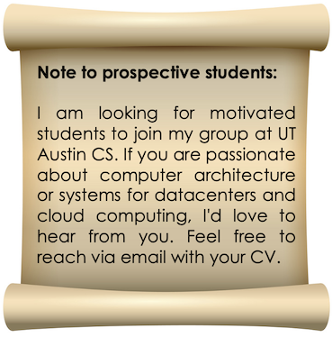

I am Jovan Stojkovic, a fifth year PhD student at the University of Illinois at Urbana-Champaign, and a member of [i-acoma group](http://iacoma.cs.uiuc.edu/) led by professor [Josep Torrellas](http://iacoma.cs.uiuc.edu/josep/torrellas.html).

<!-- 
My research focus is on the cloud platforms and emerging deployment paradigms, such as microservices and serverless computing. These workloads promise great scalability, simple programming model, and cost-effective billing model. However, their characteristics significantly differ from traditional cloud applications, leading to inefficiencies in current cloud environments. As these paradigms become more important, my goal is to design novel hardware platforms and software stacks that enable their execution with orders of magnitude better performance, energy, and resource efficiency. 
--->

My research focuses on **cloud computing and datacenters**, with two primary application domains: (1) *cloud-native* workloads such as microservices and serverless computing, and (2) *machine learning (ML) inference*, particularly large language models (LLMs).

Cloud-native workloads represent a shift in how services are deployed and managed, offering scalability, a simplified programming model, and cost-effective billing. However, these benefits come with new challenges. Unlike traditional monolithic applications, microservices and serverless functions exhibit high communication overhead, fine-grained execution, bursty invocation patterns, and focus on optimizing for tail latency—all of which lead to poor performance, resource, and energy inefficiency on conventional cloud infrastructure. As these deployment paradigms gain traction, my research aims to co-design novel hardware platforms and software systems that deliver orders-of-magnitude improvements in performance, energy efficiency, and resource utilization for these emerging workloads.

In parallel, I focus on the rapidly growing demands of ML inference, especially the inference of generative LLMs. These models now serve latency-sensitive applications under strict Service Level Objectives (SLOs), often relying on power-hungry GPUs to meet performance demands. This has led to a dramatic rise in power draw and energy consumption from inference clusters. My work addresses this challenge through smart scheduling, workload placement, and system-level configuration tuning to reduce energy, power, and thermal overheads—while maintaining performance and accuracy guarantees.

My work was recognized with an [HPCA Best Paper Award](https://jovans2.github.io/files/DynamoLLM_HPCA2025.pdf) and an [IEEE MICRO Top Picks Honorable Mention](https://jovans2.github.io/files/uManycore_ISCA2023_Final.pdf). I filed six patents with IBM and Microsoft for my work in serverless software stack design, processor overclocking in the cloud, and energy management for LLM inference workloads in the cloud.
I was awarded the [W. J. Poppelbaum Memorial Award](https://siebelschool.illinois.edu/about/awards/graduate-fellowships-awards/w-j-poppelbaum-memorial-award) for achievements in computer hardware and architecture, based on academic performance and design creativity.
I was selected for the [Mavis Future Faculty Fellowship (2024-2025)](https://mavis.grainger.illinois.edu/) to enhance my skills in research, teaching and mentoring as a future engineering faculty.
I was invited as one of the 30 young researchers in computer science and mathematics worldwide to present my work at the
[11th Heidelberg Laureate Forum (2024)](https://www.heidelberg-laureate-forum.org/forum/11th-hlf-2024.html).
I won the [Kenichi Miura Award (2022)](https://cs.illinois.edu/about/awards/graduate-fellowships-awards/kenichi-miura-award) for excellence in High Performance Computing.
I was awarded multiple student travel grants to attend ISCA, MICRO, ASPLOS, and HPCA conferences.

I completed my undergraduate studies at [School of Electrical Engineering](https://www.etf.bg.ac.rs/en), University of Belgrade, Serbia. Every year (2017-2020), I was recognized as the best student of Computer Engineering and Information Theory Department.

